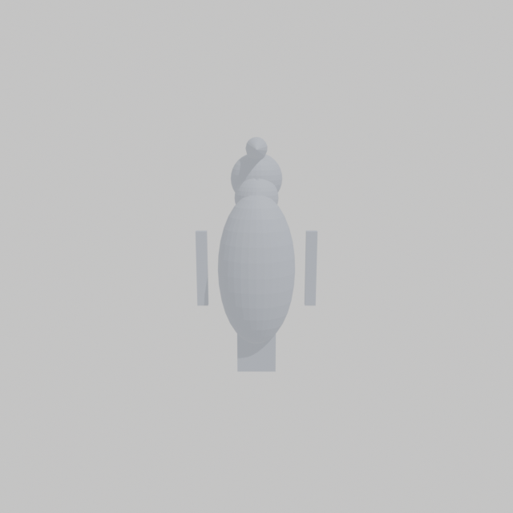

# Pigeon Control

Computational ornithological warfare. Julia runs the flock. Godot just watches, and occasionally drops bread.



 

## About

Pigeon Control started as a joke about dots that do math.
The dots learned to flock, then to land, eat, flee, and fight over crumbs, and the joke grew wings.
Now it is a small engine: thousands of pigeons in a 50 by 50 meter plaza, simulated in Julia and drawn by Godot.

I like the split because it removes the thing that makes simulations miserable.
Julia owns the truth.
Godot owns nothing worth arguing about.
They meet on a wire, and neither side can quietly move a pigeon behind the other's back.

The default seed is `69420`.
Run it and you get "The Great Bread Massacre" every time, same birds, same stampede.
That reproducibility is not a party trick.
It is the only reason the fear and feeding behavior are debuggable at all.

## Features

- Thousands of boids at once, each with its own genome driving flocking weights and bravery.
- Real behavior states: flying, walking, eating, fleeing, landing, takeoff, fighting, perching.
- Bread matters. Drop it and the flock switches from drifting to a feeding scrum.
- Humans matter more. Spawn one and pigeons inside 12 meters break ranks and run.
- A custom binary UDP protocol that ships snapshots as one packet or fragments them when the flock is huge.
- A renderer that only witnesses. Godot never decides a pigeon's next move.
- Live control over the wire: drop bread, summon a human, clear the plaza, all while it runs.

## Architecture


Julia steps the world, packs it into bytes, and sends those bytes to Godot.
Godot parses them and poses the `MultiMeshInstance3D`.
Commands go the other way on a second port and feed straight into the next simulation step.

The wire format is the contract, and it lives in three places that must stay in sync: `src/protocol/snapshot.jl`, `docs/PROTOCOL.md`, and `godot/scripts/SnapshotParser.gd`.
The full layout and the fragmentation rules are in [docs/PROTOCOL.md](docs/PROTOCOL.md).
The module map and data flow are in [docs/ARCHITECTURE.md](docs/ARCHITECTURE.md).

## Quickstart

From the repository root, terminal 1 runs the simulation server:

```bash
julia --project=. experiments/run_server.jl --seed 69420 --n 2000 --port 5000 --fps 60
```

Terminal 2 runs the renderer:

```bash
godot --path godot
```

You can also open the project in the Godot editor and press Play.
Point Godot at the same machine as the server and the birds appear.

## Control commands

Commands are plain text over UDP, one per packet, on port `snapshot_port + 1` (5001 by default).

- `DROP_BREAD x y z amount` scatters bread crumbs the pigeons eat.
- `SPAWN_HUMAN x y z` drops a human into the plaza and the flock scatters.
- `CLEAR_HUMAN` removes every human.
- `KILL_THE_SUN` is a no-op, kept for the drama.

In Godot, the keys do the typing for you.
Press **B** to drop bread under the cursor, **H** to spawn a human, **C** to clear, and **K** for the sun.

## Development

Install Julia dependencies once:

```bash
julia --project=. -e 'using Pkg; Pkg.instantiate()'
```

Run the test suite:

```bash
julia --project=. test/runtests.jl
```

The Godot side has headless self tests:

```bash
cd godot && godot --headless -s res://scripts/_selftest.gd
cd godot && godot --headless -s res://scripts/_fragtest.gd
```

## Documentation

- [docs/PROTOCOL.md](docs/PROTOCOL.md) is the canonical wire specification.
- [docs/ARCHITECTURE.md](docs/ARCHITECTURE.md) maps the modules and the data flow.

## Limitations

The server pairs with a listener.
On macOS, sending a UDP datagram to a closed port can block forever, so always run Godot, or any listener, on the snapshot port.
With a listener present, sends return instantly and the server exits cleanly on a duration or Ctrl-C.

Performance is honest about its budget.
A few thousand pigeons step at well under 60 frames per second today.
Faster stepping is a later milestone, not a mystery: structure-of-arrays and threading are the obvious levers.

## License

No license file yet.
Assume it is not open source until one is added.
