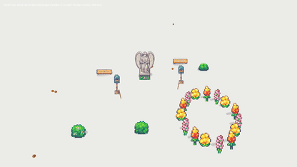
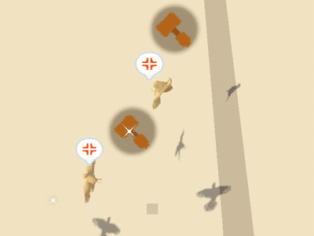
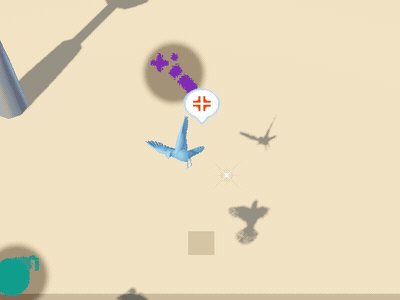
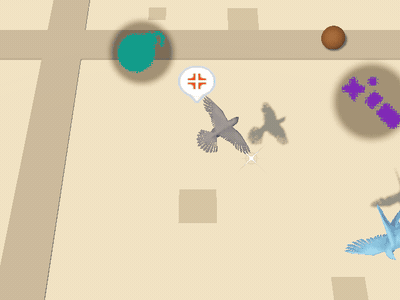
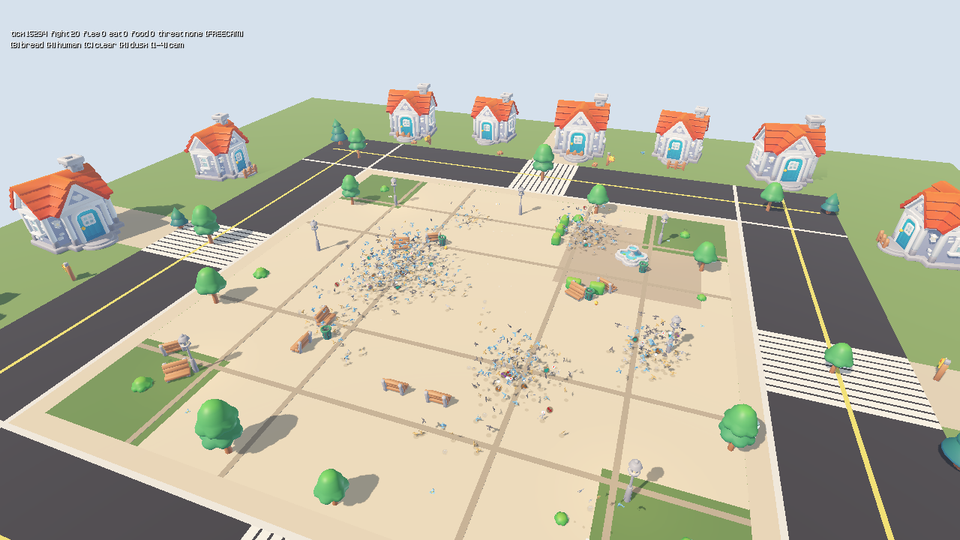
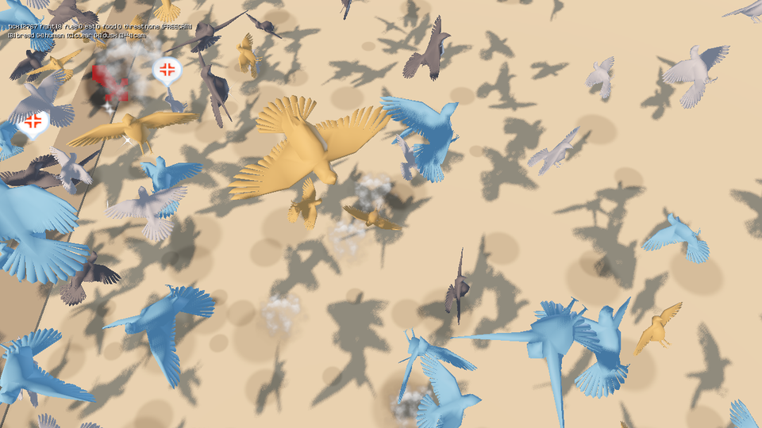
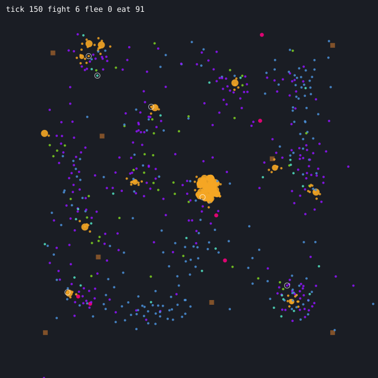
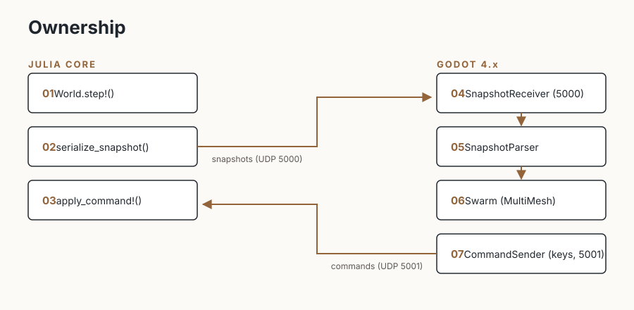

# Pigeon Control

Thousands of pigeons fight over bread in a low-poly city plaza.

  

<table>
  <tr>
    <td align="center"> Crumb Goblin · hammer</td>
    <td align="center"> Sky Scout · wand</td>
    <td align="center"> Bruiser · bomb</td>
  </tr>
</table>

Julia owns the deterministic simulation.
Godot receives binary snapshots over UDP and renders the flock.
The same seed, configuration, and inputs reproduce the same stampede.
Neither side gets to do the other's job, no matter how persuasive the pigeons become.

## Inside the plaza

- Thousands of individually weighted boids that bank into turns and stretch with speed
- Hunger, food competition with visibly shrinking crumbs, fear, flight, perching on lamps and benches, and combat with feathers and impact bursts
- Four pigeon archetypes with different silhouettes and behavior biases
- Live bread drops, human threats, and a dusk sky when you kill the sun
- Four cameras (freecam, brawl follow, cinematic orbit, security corners) and a HUD fed by authoritative stats
- A renderer that never decides simulation behavior

## What it looks like

  

  

Both frames are real captures from the Godot renderer, streamed live from Julia over the version-2 protocol.
The HUD counts come from authoritative sim stats, and every puff, star, and shadow below a bird is sim-owned visual state drawn by the renderer.

  

The map above is the same world through Julia's eyes, drawn straight from a version-2 snapshot.
Blue is flying, green walking, amber eating, red fleeing, violet landing, teal takeoff, pink fighting, brown perching.
Amber dots are crumbs (they shrink as they are eaten), brown squares are perches, the red ring is the human threat, white rings are fresh visual events.
Regenerate it any time with `julia --project=. experiments/visual_debug.jl --out docs/visual_debug.svg`.

## Explore

- [Run, control, test, and study the project](GUIDE.md)
- [Architecture](docs/ARCHITECTURE.md)
- [Wire protocol](docs/PROTOCOL.md)
- [Observer experiment](docs/OBSERVER_EXPERIMENT.md)
